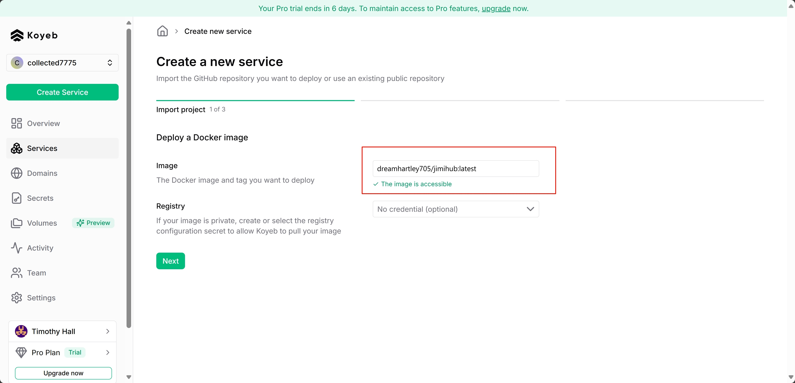

# Koyeb 部署

此部署方式利用 Koyeb 的 Docker 环境运行，并**强制要求启用 GitHub 同步**功能以实现数据持久化。

1. **准备 GitHub 仓库和 PAT**(不可跳过):
   
   * 你需要一个**自己的** GitHub 仓库来存储同步的数据。建议使用私有仓库。
   * 创建一个 GitHub Personal Access Token (PAT)，并确保勾选了 `repo` 权限范围。**请妥善保管此 Token**。
   * 具体操作步骤详见[GitHub配置同步教程](../GitHub/GitHub同步.md)
   
2. **在 Koyeb 创建并部署容器**:
   
   * 访问 [Koyeb注册页面](https://app.koyeb.com/auth/signup)。
   * 选择一个方式创建账户，可以使用GitHub账号，或邮箱进行注册。
     
   * 注册并验证账号后，在页面中输入一个自定义的组织名称，后续选项可以随意选择或跳过。
     
   * 进入主界面后，在右侧选择Docker容器部署。
     
   * 在Image选项填写`dreamhartley705/jimihub:latest`，点击下一步。
     
   * 在配置选择界面，选择`CPU Eco`，并选择一个免费的容器类型，点击下一步。
     
   * 来到详细配置页面，在`Edit variables and files`中配置环境变量，请确保填写`ADMIN_PASSWORD`,`GITHUB_PROJECT`,`GITHUB_PROJECT_PAT`这三个变量。`GITHUB_ENCRYPT_KEY`为可选的数据库加密选项，如果需要请自行填写。
     
   * 选择`Exposed ports`选项，将端口修改为`3000`。
     
   * 选择`Service name`选项，设置一个自定义的容器名称，请不要使用默认的名称。
     
   * 配置完成后，点击`Deploy`即可创建容器。
     
   * 在新页面中，等待容器创建完成，上方的`Public URL`为访问地址。
     

3. **在后台中进行设置**

   * 在后台UI中进行配置 Api 连接，详细请参考[配置API连接教程](../../Usage/配置API连接.md)。

4. **Koyeb 容器保活(可选)**

   * Koyeb 容器将在未使用时自动关闭，并且再次请求时自动启动，这会导致容器重启后第一次的请求时间大幅度延迟，如果您希望让容器保持运行，可以参考[配置Uptimerrobot](../Uptimerobot/配置Uptimerrobot.md)中的内容。
